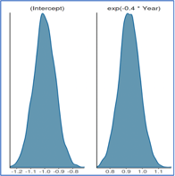

## Modelling Chess Player Performances

**Comparing Performance of Anand Viswanathan and Magnus Carlsen:**

Figure below shows the box plot of the ACPL of the two players. The mean of the ACPL scores of Anand, Vishwanathan is 14.15 while the mean of the ACPL scores of Carlsen, Magnus is 10.7. Hence the difference between the average of the ACPL scores of the two people is 3.45 suggesting that the mean of Anand’s ACPL is higher than Carlsen’s. However, there is a possibility that if we don’t consider some of the high ACPL games of Anand or the low ACPL games of Carlsen in the sample, the results might be completely different. Running a T-test on the average scores with the null hypothesis that the mean ACPL is 0, we get a t-score of 1.9494 which has a p-value of 0.05514. This suggests that ACPL of both these players come from the same distribution. However, the box plot reveals something different. We will use Bayesian Analysis to obtain more information on this

Considering μ as the population mean, we can model the mean ACPL of Anand, Vishwanathan as μ+ δ and the mean of Carlsen, Magnus as μ- δ. The difference between the two means then becomes 2*δ. The within group variance can be modelled as 1/ζ .

The distribution of the three variables are assumed as follows:

μ ~ N(μ_0,1/ζ_0)

δ ~ N(δ_0,1/γ_0)

ζ ~ Gamma(a_0,b_0)

Considering that the average ACPL score of the entire dataset containing all players is 20.22, we can keep μ_0 = 20. To keep the values of μ between 6 and 34 within 2 standard deviations of the distribution, we can keep ζ_0 = 1/7^2 = 1/49. 

We keep δ_0 = 0 to not bias the results in favor of anyone. The maximum score in the entire dataset is 114.2 and minimum is 2.35. Hence the difference between the mean can never be more than 114.2-2.35 ~ 112. Hence, we will try to keep half of this value with two standard deviations in the distribution. Hence γ_0=1/23^2 = 1/529. We will assume that a_0=1 and b_0 = 20.

Using the Gibbs sampler for 5000 iterations we get the results shown in Figure above. As can be seen the value of the population mean lies between 11 and 14. The value of δ lies between 0 and 4. Since we started with a prior distribution of  δ_0 = 0, the posterior distribution evidently shows that there is a positive difference between the ACPL means of Anand, Vishwanathan and Carlsen, Magnus. Hence we can conclude that Carlsen, Magnus is a better player than Anand, Vishwanathan by a value of 0 to 8(2* δ).

**Comparing all players**

Figure above shows a visualization of various Player’s ACPL in the form of a box plot. However, this visualization is not enough to compare the different players as there is difference in the sample sizes for different players. Figure below shows the sample sizes for the different players. 

As can be seen from the plot there are players whose sample size is less than 10. To achieve a proper comparison, we can borrow information from the players having high sample sizes

Figure above shows that the majority of the ACPL values lie between 0 and 50. Figure 60 shows that the extreme values of the mean ACPL scores are generally for players with 
smaller sample sizes.

Just like above, we model the problem as follows:

μ   ~ N(μ_0, 1/ζ_0)

ζ_b ~ N(a_0, b_0)

ζ_w ~ Gamma(α, β)

μ represents the population mean of the ACPL scores. 1/ζ_b represents the variance between scores of different players. 1/ζ_w represents the variance between the scores of any player. 

As can be seen in above figure, majority of the ACPL values lie between 4 and 60. Hence, to cover these values within two standard deviations of the distribution, we will assume μ_0 = 30, 〖1/ζ〗_0= 1/100, a_0=1, b_0= 225, α=1,β=225. The expected values of ζ_b and ζ_w from the prior then becomes 1/225 which makes the standard deviation as 15.  Running the Gibbs sampler for 5000 iterations, the mean of the posteriors are as follows:

Mean of μ = 21.217 	  &nbsp;&nbsp;&nbsp;&nbsp;      Standard Deviation of μ = 1.486

Mean of ζ_w = 0.00759 	&nbsp;&nbsp;&nbsp;    Standard Deviation of ζ_w = 0.00034

Mean of ζ_b = 0.0137 	&nbsp;&nbsp;&nbsp;&nbsp;    Standard Deviation of ζ_b = 0.0037

Figure above shows the mean of ACPL of different players against their original sample size.

Figure above shows the mean of ACPL of different players obtained from posterior against their original sample size.

It can be seen that for players with a smaller sample size, the average ACPL scores have been pulled towards the population mean. This is because for these players, information is borrowed from the population.

From the box plot above, Karjakin, Sergey has lowest mean ACPL values. Carlsen, Magnus is ranked second. However the variance of Karjakin’s average ACPL is more than Carlsen showing more certainty about Carlsen’s ACPL. Chigorin, Mikhail has the highest average ACPL values showing that he is the most inferior among the given players.

**Modelling Player Performances over the years:**

**Data Preparation:**

Initially, we start with analyzing the data. Of all the columns in the data, the only columns which would potentially be of use are Black.Player, Black.ACPL, White.Player, White.ACPL, Year, and PreDeepBlue. ACPL at any step of the game only depends on the current state of the game. Hence there is no special advantage or disadvantage for a white or black player. Since we are trying to model overall player improvement, we will be considering both Black and White player performances. For this, we will extract two dataframes containing the columns Player, Year, ACPL and PreDeepBlue separately for black and white and then perform a union all operation using the rbind functionality in R. Thus, we have one combined dataframe for both type of players with the columns Player, Year, ACPL and PreDeepBlue. I have then scaled the columns Year and ACPL so that they have a mean of 0 and variance of 1. This is done to stabilize the linear algebra that will be used. The Player column is coded as a factor column. In a particular year, a player plays more than 1 game. Hence, I have taken a mean of the ACPL scores of all the games played by a player in a year. 

**Data Analysis:**

Figure above shows that on an average, the median as well as the variance of the ACPL score have decreased over the years

Figure above shows that the ACPL scores are majorly concentrated in the 4 to 55 range. Note: The graphs have been plotted before scaling and aggregating the columns.

Figure above shows the boxplot of the ACPL score before 1996 and after 1996. As can be seen there is a significant difference. However, we cannot infer that there is an improvement in the performance due to the chess engine from this, since the difference could be the result of the ACPL score gradually decreasing over time.                   

**Applying Linear Regression:**

Approach Overview:
The approach that I have followed for this problem is to start with a simple model using frequentist and Bayesian approaches and then gradually increase complexity by introducing more parameters. Once the model parameters are obtained, the AIC scores and R-squared value of the model will be compared with the previous model. After we have considered all the parameters, we will using Logistic Regression with Lasso to shrink and remove some of the parameters.

**Model 1:**

y=β_0 + β_1*PreDeepBlue

Parameter Explanation:

Before 1996 when PreDeepBlue = 1,

y=β_0+ β_1

After 1996,

y=β_0

Thus β_1 denotes the average difference between the scores before and after 1996. 

Frequentist Approach:

A p value of less than 0.001 shows a high level of certainty that the coefficients are non-zero. A positive value of β_1 signifies that the average ACPL score decreased after 1996.

AIC score: -151.09

R2 Score: 0.2473

Bayesian Approach:

As can be seen from the density plot of the coefficient of PreDeepBlue, the value ranges between 0.2 and 1.0 showing that there is positive difference between the average ACPL before and after 1996. This tells us that there is an actual improvement in average player performance over the years. 

**Model 2:**

y=β_0 + β_2*Year

This model assumes that the ACPL scores changes linearly with time. β_0 denotes the scaled average ACPL in the year 1886. β_2 denotes the average change in ACPL scores per year.

Frequentist Approach:

A negative value of β_2 signifies that the ACPL score have decreased linearly each year.
AIC score: -229.69
R2 Score: 0.6414

A lower value of the AIC score than the last model shows that this model can better capture the trend of ACPL scores. The model essentially says the scaled average scores in the year 1886 is 0.0131 and the scaled average drops by a value of 0.41005 every year.  

However, when the intercept values are considered, the standard error is extremely high with respect to estimate, thus leading to a higher p-value. This means that there is a lot of uncertainty about the average ACPL scores in 1886.

Bayesian Approach:

**Model 3:**

The ACPL is a score generated by comparing the performance of the moves played by a human with a computer. If the moves played by a human and the computer algorithm are the same, then the ACPL score would be 0. It is established in the earlier models that the average scores decrease. Intuitively speaking we need a relationship of the ACPL scores with Year in such a manner than the drop in ACPL decreases over time and after a point reached a plateau. The negative exponential decay function can capture such type of a relationship. I will test this hypothesis in the next model.

y=β_0 + β_2*exp(-θ*Year)

Here β_2 represents the exponential decrease in the average ACPL scores per year. The value of θ describes how fast the average ACPL scores decrease over time. To find the appropriate value of θ, we will need to do a lot of analysis which would be very time consuming. Hence to find the approximate value of θ, I will use a method generally used in cross validations. I will run the entire model for a given set of θ values. Using this method, I found that θ = 0.4 provides the best result.

Frequentist Approach:

Lower p values for both the intercept and β_2 show high levels of certainty about them

AIC score: -235.43

R2 Score: 0.6603

As can be seen from the AIC and R2 scores, the model performs slightly better than the last model. Another point to note is that the p values for both the intercept and coefficient values is extremely less. This shows a high level of certainty about the captured relationship between year and ACPL. This confirms our hypothesis that a exponential function better fits our data than a simple linear function. 

Bayesian Approach:     

The value of β_2 ranges between 0.7 and 1.1.  This shows that the average ACPL scores does decrease as the years go.

**Model 4:**

Combining Model 1 and Model 3, we get:

y=β_0 + β_1*PreDeepBlue + β_2*exp(-θ*Year)

Here, β_1 shows the shift in the trend of ACPL vs Year after 1996. A positive value denotes that the exponential curve of ACPL vs time moved down by a factor of β_1 after 1996. 

Frequentist Approach:

AIC score: -233.43
R2 Score: 0.6603

It can be seen from the Std.Error that there is high un-certainty above the coefficient value of PreDeepBlue. Higher values of p-value also suggest that β_1 is not non-zero. The effect of β_1 seems to be almost non-negligible as compared to β_2. 

Bayesian Approach:

The density plot of the coefficient of PreDeepBlue does not show any evidence of the PreDeepBlue. This tells us that the use of chess engines did not lead to any improvement in player performance.

As can be seen from the AIC scores of Models 3 and 4, the PreDeepBlue flag did not contribute much to the model. Hence, we can conclude that the use of chess engines had no impact on the player performances. Going forward, we will not be using the PreDeepBlue column in our analysis.

Apart from modelling the average player performance, we also need to factor in the individual player performances. It could be a possibility that some of the few players influenced the trend by their extreme performances(good/bad). Factoring in the performance of individual players will help us separate the average general player performance from the individual performances. This could help us in understanding the trend of ACPL scores vs time and enables us to see how individual players performed with respect to the average player performances during their times.

**Model with individual player performance factored in:**

y=β_0 + β_2*exp(-θ*Year) + (β_3 ) ⃗.(Player) ⃗

In the above equation,  (β_3 ) ⃗ is a vector whose elements represent the difference in average ACPL of any player and the average ACPL during their times. (Player) ⃗ is a vector obtained by performing one hot encoding on the Player column. β_0 + β_2*exp(-θ*Year) represents the average general player performance for different years.

Since we will have a lot of features in this model, we will use a Linear Regression model with Lasso to shrink some of the coefficient values. Since Lasso tries to shrink the coefficient values to 0, we could figure out if any player had the same performance as the average ACPL scores during their times.

Figure above shows that for lower feature values the mean square error along with its variance is extremely high. This shows that the model is underfit. However, as we increase the features, the model performs better. We can see that the model performs the best when the number of parameters is around 37. As we increase the number of parameters, the model performance degrades by a bit.

Since there are a lot of coefficients involved in this problem, I have not mentioned the p values and coefficients of each parameter separately. Due to computation limitations, I have also not performed a Bayesian Analysis of this model. Instead, I have portrayed the effect of all these parameters through graphs

Figure above shows the plot of β_0 + β_2*exp(-θ*Year) vs time. We can say that this represents the general player performances over time, since we have considered the individual player performance separately in the parameter  (β_3 ) ⃗.  Looking at the graph, we can say that the average ACPL will decrease exponentially in the next 10 years.

Figure above shows the Bar diagram of the elements of the vector (β_3 ) ⃗. This represents the difference in the average ACPL of any player with the average ACPL of that player’s time.

It can be seen that Bronstein David and Schlechter, Carl have been quite ahead of their times. Meanwhile Chigorin Mikhail and Morozevich. A had poor ACPL values compared to the average player ACPL during their times. The performances of Alekhine Alexander, Anand Vishwanathan, Gunsberg Isidor and Svidler P have been same as the average ACPL of their times.
